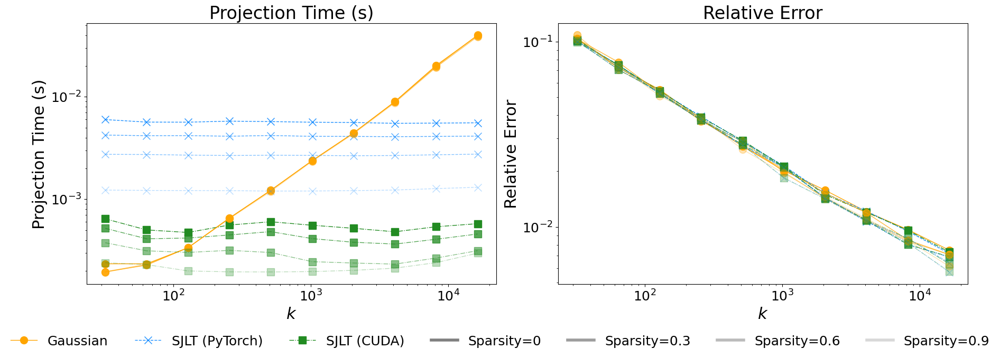

# Sparse Johnson-Lindenstrauss Transform CUDA Kernel

This is a simple repository for *Sparse Johnson-Lindenstrauss Transform* with CUDA acceleration for PyTorch.

## Features

- GPU-accelerated sparse random projections
- Supports float32, float64, and bfloat16 data types
- Optimized CUDA kernels for high performance
- Easy integration with PyTorch workflows

## Installation

### Requirements

- Python >= 3.8
- PyTorch >= 1.9.0 with CUDA support
- CUDA Toolkit (version compatible with your PyTorch installation)
- C++ compiler (GCC 7-11 recommended)

### Install from PyPI

To build the CUDA SJLT CUDA kernel, you will need to make sure that `nvcc -V` and `torch.version.cuda` gives the same CUDA version. Then, you can install `sjlt` via:

```bash
pip install sjlt
```

### Install from Source

```bash
git clone https://github.com/TRAIS-Lab/sjlt
cd sjlt
pip install -e .
```

>  [!NOTE]
> Due to the default [isolation building behavior](https://github.com/vllm-project/vllm/issues/1453#issuecomment-1951453221) of `pip install` (this applies on both "Install from PyPI" and "Install from Source"), even if `nvcc -V` and `torch.version.cuda` gives the same CUDA version, you can still encounter the something like the following:
> ```bash
> RuntimeError:
> The detected CUDA version (11.8) mismatches the version that was used to compile
> PyTorch (12.6). Please make sure to use the same CUDA versions.
> ```
> In this case, it might help to use `pip install --no-build-isolation` to force pip to build using your current virtual environment.

## Quick Start

Our SJLT implementation accepts the following parameters:

- `original_dim`: input dimension
- `proj_dim`: output dimension
- `c`: sparsity parameter, i.e., non-zeros per column (default: `1`)
- `threads`: CUDA threads per block (default: `1024`)
- `fixed_blocks`: CUDA blocks to use (default: `84`)


> [!Note]
> The input is supposed to have `batch_dim`, i.e., `input.shape()` should be `(batch_size, original_dim)` and `output.shape()` will be `(batch_size, proj_dim)`.

The following is a simple snippet of using our SJLT CUDA kernel:

```python
import torch
from sjlt import SJLTProjection

# Create projection: 1024 -> 128 dimensions with sparsity 4
proj = SJLTProjection(original_dim=1024, proj_dim=128, c=4)

# Project some data
x = torch.randn(100, 1024, device='cuda')
y = proj(x)  # Shape: [100, 128]
```

## Profile Example

To profile the performance of the SJLT CUDA kernel, you can use the provided [profile](https://github.com/TRAIS-Lab/sjlt/blob/main/example/profile.ipynb) notebook. This benchmarks the projection speed for different input sizes and sparsity levels.

<!-- Image -->


## Troubleshooting

If installation fails:

1. Ensure CUDA toolkit is installed and `nvcc` is in `PATH`
2. Check PyTorch CUDA compatibility: `python -c "import torch; print(torch.cuda.is_available())"`
3. Try reinstalling: `pip install sjlt --no-cache-dir --force-reinstall`
